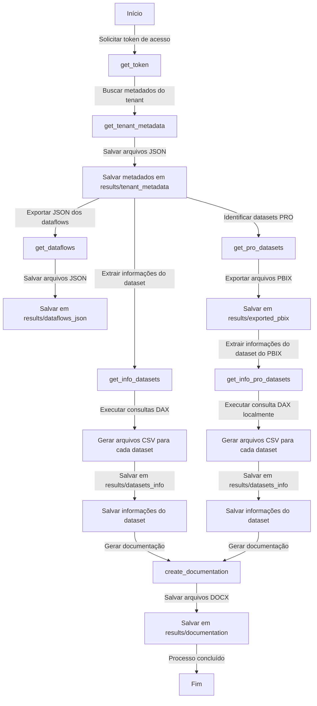

[](https://github.com/alisonpezzott/pbi-docs/blob/main/LICENSE) 


# PBI-DOCS  

## O que é?  
### Um script Python simples (mas poderoso)

Este script extrai documentação para artefatos do Power BI no Tenant usando:

- APIs REST do Power BI com SPN
- CLI do DAX Studio
- Power BI Desktop

Tudo combinado com alguma lógica. 🤯

## Como funciona?  



Este é um script Python nativo que roda localmente. Além do próprio Python e algumas bibliotecas adicionais, você precisa ter o DAX Studio e o Power BI Desktop instalados na máquina que executará o código. Todo desenvolvedor de Power BI já deve ter esses instalados, certo? 😄 Veja mais detalhes na seção `Instalação`.

### Dentro do código!

>[!NOTE]
>O script é escrito com funções def que segmentam cada etapa, tornando mais fácil e claro depurar e manter o código.


### get_token
Ao executar o script, esta função solicita o access_token usando o Service Principal devidamente configurado no Microsoft Entra.

### get_tenant_metadata
Com o access_token obtido, esta função faz várias solicitações às APIs REST do POWER BI para extrair os metadados do tenant, salvando os arquivos .json na pasta `results/tenant_metadata`. Esses arquivos contêm metadados para workspaces, dataflows, datasets e relatórios. Cada arquivo json inclui os IDs e hashes necessários para reconstruir todo o ambiente. Após concluir esta etapa, a estrutura de arquivos será a seguinte:

```lua
pbi-docs(repo-root)/
│-- results/
│   │-- tenant_metadata/
│       │-- dataflows.json
|       |-- datasets.json
|       |-- reports.json
|       |-- workspaces.json

```  

### get_info_datasets  
Esta função é, sem dúvida, a parte mais disruptiva deste processo 😱.
Com os metadados extraídos do tenant, conectamos cada dataset com o CLI do DAX Studio e executamos uma consulta DAX para obter todas as tabelas, colunas, medidas, relacionamentos, grupos de cálculo e muito mais...  

> [!IMPORTANT]
> Neste ponto, apenas datasets com workspaces em capacidades dedicadas (Fabric, Embedded e PPU) são executados, pois dependem do Endpoint XMLA, que não está disponível para licenciamento PRO. Mas desenvolvi um recurso legal que também inclui usuários PRO 🫴.

As consultas DAX geram 6 arquivos *.csv para cada dataset e os salvam na pasta `results/datasets_info/`, criando mais subpastas. Por exemplo, para Dataset A no Workspace A, ficaria assim:

```
   results/datasets_info/Dataset A/Workspace A/partitions.csv
   results/datasets_info/Dataset A/Workspace A/columns.csv
   results/datasets_info/Dataset A/Workspace A/measures.csv
   results/datasets_info/Dataset A/Workspace A/relationships.csv
   results/datasets_info/Dataset A/Workspace A/parameters.csv
   results/datasets_info/Dataset A/Workspace A/calculation_groups.csv
```  
A árvore de arquivos ficaria assim:

```lua
pbi-docs(repo-root)/
│-- results/
│   │-- datasets_info/
│       │-- Workspace A/
|           |-- Dataset A/
|               |-- partitions.csv
|               |-- columns.csv
|               |-- measures.csv
|               |-- relationships.csv
|               |-- parameters.csv
|               |-- calculation_groups.csv
|           |-- Dataset B/
|               |-- partitions.csv
|               |-- columns.csv
|               |-- measures.csv
|               |-- relationships.csv
|               |-- parameters.csv
|               |-- calculation_groups.csv
│       │-- Workspace C/
|           |-- Dataset C/
|               |-- partitions.csv
|               |-- columns.csv
|               |-- measures.csv
|               |-- relationships.csv
|               |-- parameters.csv
|               |-- calculation_groups.csv
```


> Sim, esta é a mesma consulta DAX que desenvolvi em julho de 2024 para obter a documentação de um dataset localmente. Eu apenas dei um impulso 😎  
> Veja o repositório antigo [aqui.](https://github.com/alisonpezzott/documentacao-daxstudio)  

### get_dataflows  

Esta função exporta os arquivos JSON de cada dataflow do tenant. É aconselhável manter esses arquivos para possíveis recuperações e migrações. Eles são salvos na pasta `dataflows_json` com a seguinte estrutura no nome do arquivo:  

```
Padrão:
nome_do_workspace$nome_do_dataflow.json

Exemplos:
Workspace A$Dataflow A.json
Workspace B$Outro Dataflow.json

```

### get_pro_datasets  

_Lembra quando eu disse que não tinha esquecido dos usuários PRO?_

Esta função vai até a pasta tenant_metadata e filtra os datasets que não estão em capacidades dedicadas, listando apenas os datasets PRO e exportando-os para a pasta local `results/exported_pbix/` usando uma estrutura semelhante às seções anteriores, adotando o workspace como subpastas.

```lua
pbi-docs(repo-root)/
│-- results/
│   │-- exported_pbix/
│       │-- Workspace A/
|           |-- Dataset A.pbix
|           |-- Dataset B.pbix
│       │-- Workspace C/
|           |-- Dataset A.pbix
|           |-- Dataset D.pbix
```

> [!IMPORTANT]
> O método da API usado é reports/export. Não há método para exportar o próprio Dataset, mas usando este método para exportar o relatório, ele traz o dataset junto. Obviamente, este método não cobre relatórios que estão em modo direto com outros datasets. Portanto, sempre mantenha um relatório padrão conectado ao dataset, para que você possa obter os dados através deste relatório padrão.
> Veja mais em: https://learn.microsoft.com/en-us/rest/api/power-bi/reports/export-report-in-group  

### get_info_pro_datasets  

Esta função, semelhante aos datasets premium, obtém as tabelas, colunas, medidas, etc., dos arquivos PBIX exportados e adiciona os dados à pasta `datasets_info`.
A diferença aqui é que, como não temos o XMLA para conectar o CLI do DAX Studio ao dataset, estamos abrindo o Power BI Desktop com cada arquivo PBIX e executando a consulta DAX localmente. Uma vez que os dados são extraídos, o Power BI Desktop é fechado automaticamente, e este ciclo é repetido para cada arquivo PBIX. Incrível, certo?

### create_documentation  

Tendo todos os dados extraídos em seus respectivos diretórios, esta função cria um documento Microsoft Word `.docx` para cada um dos datasets extraídos e os salva na pasta `documentation` com o nome do arquivo no formato `nome_do_workspace$nome_do_relatorio.docx`.  

## Instalação  

> [!IMPORTANT]
> Siga estes passos um por um cuidadosamente.  

1. Certifique-se de que você tem os seguintes softwares já instalados:
    1. Microsoft Power BI Desktop [MS Store](https://apps.microsoft.com/detail/9NTXR16HNW1T) 
    2. DAX Studio [Baixe aqui](https://github.com/DaxStudio/DaxStudio/releases)
    3. Python [python.org](https://www.python.org/downloads/) 
    4. Bibliotecas pandas pythonnet psutil pydocx
      - Se você não tiver, execute: pip install pandas pythonnet psutil pydocx  
    5. VS CODE [MS Store](https://apps.microsoft.com/detail/XP9KHM4BK9FZ7Q)  
    6. Git [Baixe aqui](https://git-scm.com/downloads) 
2. Abra o Repositório GitHub. Faça um Fork e Clone para o VS Code!;
3. Clique em `src/pbi_docs.py`
4. Abra o Power BI Desktop. Com o Power BI Desktop ainda aberto, abra o Gerenciador de Tarefas (CTRL+ALT+DEL). Nos aplicativos em execução, encontre a tarefa do Power BI Desktop e expanda. Clique com o botão direito e depois em `Abrir local do arquivo`. Encontre o arquivo PBIDesktop.exe, clique com o botão direito e depois em `Copiar como caminho`. 
Cole no código na constante `pbi_desktop`, por exemplo:
```python
# Path Power BI Desktop
pbi_desktop = r"C:\Program Files\WindowsApps\Microsoft.MicrosoftPowerBIDesktop_2.140.1205.0_x64__8wekyb3d8bbwe\bin\PBIDesktop.exe"`
```  
5. Verifique se os caminhos dos componentes do DAX Studio estão corretamente referenciados, por exemplo:
```python
# Path DAX Studio CLI
cmd = r"C:\Program Files\DAX Studio\dscmd.exe"
# Path Analysis Services
ssas_dll = r"C:\Program Files\DAX Studio\bin\Microsoft.AnalysisServices.dll"
```
6. Aplicativo Service Principal configurado no Portal Azure (Entra)
7. Recomenda-se configurar nas variáveis de ambiente (ou Key Vault)
8. APIs e XMLA habilitados no Portal Admin do Fabric
9. Conceda acesso aos workspaces para o Service Principal
10. Execute o script
11. Aproveite sua documentação na pasta `results`!
12. Compartilhe com a Comunidade! 🚀

## Relatório Power BI

Na pasta `pbi`, você pode atualizar o Relatório Power BI com um caso de uso dos arquivos de resultado. 🤯
Apenas confirme o caminho no parâmetro no Power BI. Aproveite!  

  

 


## Contribuindo  

Aceitamos contribuições da comunidade! Se você tiver sugestões, relatórios de bugs ou quiser contribuir com código, siga estes passos:

1. Faça um Fork do repositório no GitHub.
2. Crie um novo branch com um nome descritivo.
3. Faça suas alterações e comite-as com mensagens claras e concisas.
4. Envie suas alterações para o seu repositório forkado.
5. Abra um pull request para o repositório principal.

Por favor, certifique-se de que seu código segue os padrões de codificação do projeto e inclui testes apropriados. Agradecemos suas contribuições e estamos ansiosos para colaborar com você!

## Licença

Este projeto é licenciado sob a Licença MIT. Veja o arquivo [LICENSE](https://github.com/alisonpezzott/pbi-docs/blob/main/LICENSE) para mais detalhes.  

## Contato

Para quaisquer perguntas ou dúvidas, entre em contato conosco através do rastreador de problemas do repositório GitHub ou contate diretamente o mantenedor do projeto.

Obrigado por usar e contribuir com o PBI-DOCS! Vamos tornar a documentação de dados mais fácil e eficiente juntos! Vamos continuar a expandir os limites das Comunidades Microsoft Fabric e Power BI! 🚀

## 🙋‍♂️ Suporte

Se você gosta deste projeto, dê uma ⭐ e compartilhe com amigos!

[](https://www.youtube.com/channel/UCst_4Wi9DkGAc28uEPlHHHw?sub_confirmation=1)
[](https://github.com/sponsors/alisonpezzott)
[](https://linkedin.com/in/alisonpezzott)